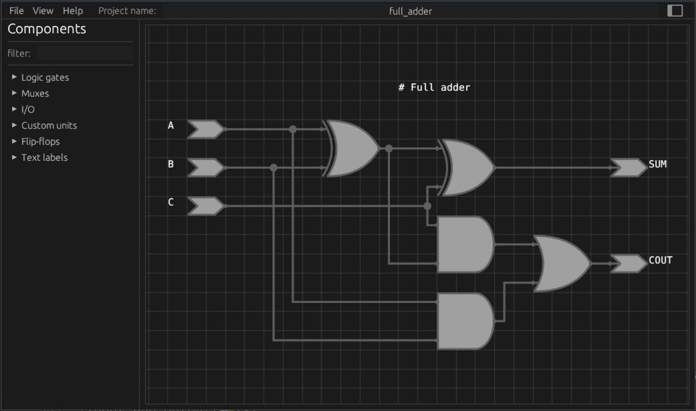
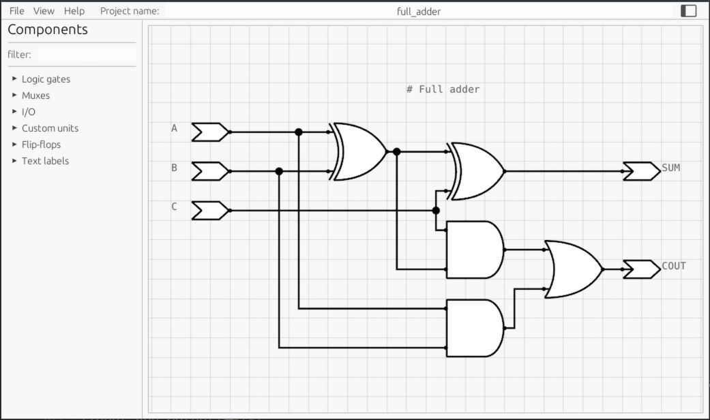

## Schematic Editor

[Web Demo](https://nikonufrienko.github.io/editor/)

*Use Ctrl+F5 to force refresh the page to the latest version*

Dark theme:

Light theme:

Key features:
* Editing schematics and saving them to a JSON file.
* Loading schematics from a JSON file.
* Exporting schematics to SVG.

## Component Types:

|Type|Available Actions|
|-|-|
|Primitives|Rotation, customization (modifying various parameters)|
|Custom Blocks|Adding, renaming, and deleting ports|
|Text Fields|Editing|

## Supported Primitives:

|Components|Status|Customizable Parameters|
|-|-|-|
|Logic Gates (AND, OR, XOR, NAND)|✅| Number of inputs|
|Inverter (NOT) |✅| -|
|Multiplexers|✅|Number of inputs|
|Demultiplexers|🔄|Number of outputs|
|D-type flip-flop|✅|Presence of reset ports and their polarity, presence of enable input|
|Point|✅|-|
|Input and Output|✅|-|
|Comparator (<, <=, >, >=, ==)|✅|Comparison operation type|
|Adder|✅|Presence of carry-in, carry-out|

## Supported Platforms:

|Platform|Status|
|-|-|
|WASM|✅|
|Linux|✅|
|Windows|✅|
|Android|🔄|

## Localizations:

* Russian
* English
* Simplified Chinese (AI-generated)

## TODO List:

* [ ] Improve Net construction. Implement smart construction patterns.
* [ ] Add functionality to split Net into two parts with a new Point.
* [ ] Add more components.
* [ ] Add a "Fit to view" button to focus on all placed components.
