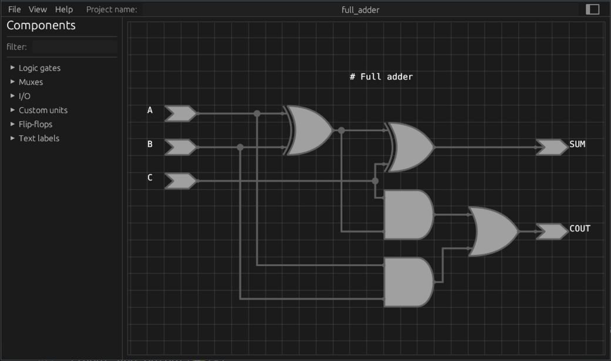
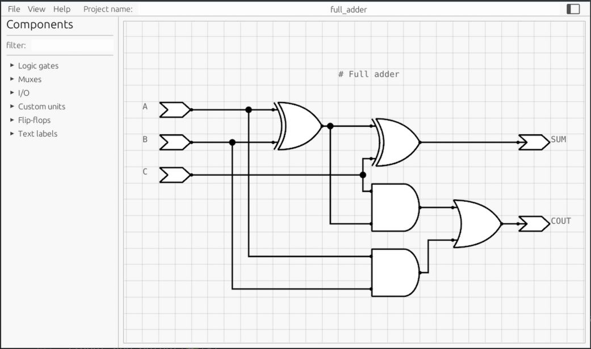

## 电路图编辑器

深色主题:

浅色主题:

主要功能:
* 编辑电路图并保存为JSON文件
* 从JSON文件加载电路图
* 导出电路图为SVG格式

## 组件类型:

|类型|可用操作|
|-|-|
|基础元件|旋转、自定义(修改各种参数)|
|自定义模块|添加、重命名和删除端口|
|文本框|编辑|

## 支持的基础元件:

|组件|状态|可配置参数|
|-|-|-|
|逻辑门(AND, OR, XOR, NAND)|✅| 输入数量|
|反相器(NOT) |✅| -|
|多路复用器|✅|输入数量|
|解复用器|🔄|输出数量|
|D触发器|✅|复位端口及其极性，使能输入|
|连接点(Point)|✅|-|
|输入和输出|✅|-|
|比较器(<, <=, >, >=, ==)|🔄|比较操作类型|
|半加器|🔄|-|
|全加器|🔄|-|

## 支持的平台:

|平台|状态|
|-|-|
|WASM|✅|
|Linux|✅|
|Windows|✅|
|Android|🔄|

## 本地化支持:

* 俄语
* 英语
* 简体中文(由AI生成)

## 待办列表:

* [ ] 改进网络构建，引入智能构建模式
* [ ] 添加拆分网络功能并添加新连接点(Point)
* [ ] 添加更多组件
* [ ] 添加"适应视图"按钮以聚焦所有已放置组件
